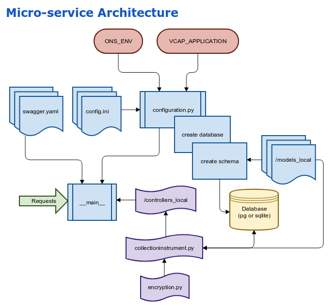
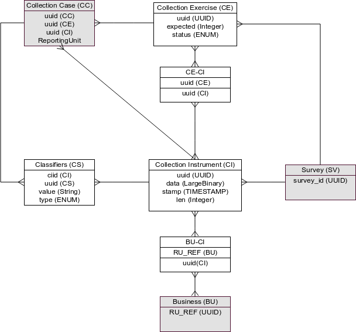

# Collection Instruments API Microservice
[](https://travis-ci.org/ONSdigital/ras-collection-instrument-demo) 
[](https://codecov.io/gh/onsdigital/ras-collection-instrument-demo)

This server contains auto-generated code, please refer to the 
[ras-swagger-codegen](https://github.com/ONSdigital/ras-swagger-codegen) project, before making changes 
to this repository.

## Overview

This repository implements REST endpoints for the RAS Collection Instrument based on the Swagger API 
definition [here](https://app.swaggerhub.com/apis/oddjobz/collection-instrument-api/1.0.2).
If you need to make a change to the REST interface, please start by changing the API spec, then regenerate 
the code using the code generator in the repository described above.



#### Your changes

Changes should only be made to code in the following folders;

* swagger\_server/controller\_slocal
* swagger\_server/tests\_local
* swagger\_server/models\_local
* README.md
* local.ini

You will find general configuration options in **config.ini**, these can
be overridden on a stanza by stanza basis by putting project specific
options in **local.ini**.

Anything else is at risk of being overwritten.

### Database Design

Note, this is subject to change, but for now the Database model is based
on this diagram;



## Running Locally

To run locally from the root of your repository, run;

```bash
./run.sh
```

On your first attempt it will build a virtual environment in .build, which will take 30 seconds or so, on 
subsequent runs this will be almost instantaneous. By default the service will be available 
on **http://localhost:8080/collection-instrument-api/1.0.1/ui**.

### Uploading files from the command line

Note that starting with this release we have introduced a UUID type into
the database which maps to the various parmameters that can be supplied
to endpoints. These UUID types are **validated** which means you will need
to supply valid UUID's when testing.

For testing, you can upload from the **scripts** folder, you should be able to run;

```bash
ce=`python3 -c "from uuid import uuid4; print(uuid4())"`
./upload.py local $ce 30
```
To upload files to the current CF installation, use **live** instead of local.
A batch (collection exercise) will be created automatically based on the UUID you
supply - if it doesn't already exist.

#### Testing

To run the unit tests and code coverage, run the test.sh script an you should get something like this;

```bash
$ ./scripts/test.sh
================================================================================================= test session starts =================================================================================================
platform linux -- Python 3.5.3, pytest-3.0.7, py-1.4.33, pluggy-0.4.0
rootdir: /home/gareth/ONS/ras-repos/ras-collection-instrument, inifile:
plugins: cov-2.5.1
collected 23 items

swagger_server/test/test_ciupload_controller.py .......
swagger_server/test/test_respondent_controller.py ..
swagger_server/test/test_static_controller.py .
swagger_server/test_local/test_ciupload_controller.py ..........
swagger_server/test_local/test_encryption.py ...

----------- coverage: platform linux, python 3.5.3-final-0 -----------
Name                                                        Stmts   Miss  Cover   Missing
-----------------------------------------------------------------------------------------
swagger_server/controllers_local/ciupload_controller.py        45      0   100%
swagger_server/controllers_local/collectioninstrument.py      167      0   100%
swagger_server/controllers_local/encryption.py                 23      0   100%
swagger_server/controllers_local/respondent_controller.py      11      0   100%
swagger_server/controllers_local/static_controller.py           6      0   100%
-----------------------------------------------------------------------------------------
TOTAL                                                         252      0   100%
```

